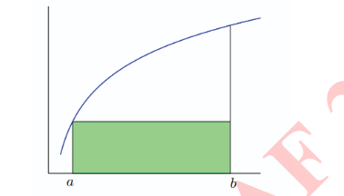
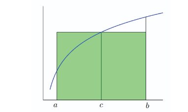
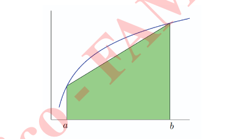

# Teorema de valor intermedio
Sea
- f continua en [a,b]
- d un numero entre f(a) y (b)

Entonces
- $\exists c \in (a,b):f(c) = d$

# Teorema de valor medio
Sea
- f continua en [a,b]
- f derivable en (a,b)
- $\forall x,c \in [a,b]$

Entonces
- $\exists \xi$ entre $x$ y $c : \frac{f(x)-f(c)}{x-c} = f'(\xi)$

o equivalentemente
- $f(x) = f(c) +f'(\xi) (x-c)$

# Teorema de Taylor
$C^n \rightarrow $ Continua y derivable hasta n
Sea
- $f \in c^n [a,b]$
- $f^{(n+1)}$ existe en $(a,b)$
- $\forall x,c \in [a,b]$

Entonces
- $f(x) = \sum_{k=0}^n \frac{1}{k!} f^{(k)}(c) (x-c)^k + E_n(x)$
- Con $E_n(x) = \frac{1}{(n+1)!} f^{(n+1)}(\xi) (x-c)^{n+1}$
- $\xi$ entre x y c

## Ejemplo de aproximacion
- $100 * \sqrt{2} * \sqrt{3} \approx 243,93$ tomando dos decimales, aproxima $\sqrt{2} \approx 1,41$  $\sqrt{3}\approx 1,73$
- $100 * \sqrt{2} * \sqrt{3} \approx 244,9489...$ tomando todos los decimales de calculadora

La idea clave es la propagacion del error

# Definicion
Sea 
- $n \geq N$

## Definimos Convergencia lineal
Sea $0 < c < 1$
- $|X_{n+1}-X_*| \leq C|X_n-X_*|$

- equivalentemente
    - $\lim_{n \to \infty} |\frac{X_{n+1}-X_*}{X_n-X_*}| \leq 1$

## Definimos Convergencia Superlineal
- $|X_{n+1}-X_*| \leq \Epsilon_n|X_n-X_*|$
- donde $\{\Epsilon_n\}_{n\rightarrow\inf} \rightarrow 0$

## Definimos Convergencia Cuadratica
- $|X_{n+1}-X_*| \leq k|X_n-X_*|^2$
- equivalentemente
    - $\lim_{n \to \infty} | \frac{X_{n+1}-X_*}{(X_n-X_*)^2} | = k$
        - k existe

# O grande y o chica
## O Grande
determina que la funcion $X_n$ crece a lo sumo tan rapido como $\alpha_n$ (explicacion aproximada)
- $X_n = O(\alpha_n)$ si $\exists c>0, r\in \N : |X_n| < C|\alpha_n|$ con $n \geq r$
- Equivalentemente
    - $X_n = O(\alpha_n)$ si $\exists c>0 : \lim_{n \to \infty} |\frac{X_n}{\alpha_n}| < C$
    - suponiendo $\alpha_n \neq 0$
## o chica
determina que la funcion $\alpha_n$ crece mas rapido que $X_n$ (explicacion aproximada)
- $X_n = o(\alpha_n)$ si $\exists \{\Epsilon_n\}\rightarrow 0, r\in \N : |X_n| < \Epsilon_n|\alpha_n|$ con $n \geq r$
- Equivalentemente
    - $X_n = o(\alpha_n)$ si $\exists \{\Epsilon_n\}\rightarrow 0 : \lim_{n \to \infty} |\frac{X_n}{\alpha_n}| = 0$
    - pues $\Epsilon_n \to 0$
    - suponiendo $\alpha_n \neq 0$

# Evaluacion de polinomios y cantidad de operaciones
Sea p(x) un ejemplo
$ p(x) = a + bx + cx^2 + dx^3 + ex^4$
con k terminos
## Metodo 1 - Rustico

Sumar y multiplicar los terminos
con $x^n = x * x * ... * x = \prod_{i=1}^{n} x $
    se multiplican las x una a una

- Hay k-1 Sumas
- supongamos que existen m terminos multiplicados por $x^i$ con $i \geq 1$
    - cada uno de estos tiene entre 1 y k multiplicaciones
    - $\frac{(m+1) * m}{2} $
- suponiendo que p(x) es nuestro ejemplo
    - 4 Sumas
    - 10 multiplicaciones

## Metodo 2 - Semirustico

Rustico sumado a la idea de que $x^n = x^{n-1}*x$
- Hay k-1 Sumas
- supongamos que existen m terminos multiplicados por $x^i$ con $i \geq 1$
    - $ 1 + \sum_{i=1}^{m-1}2$
        - $bx \rightarrow 1$ multiplicacion
        - $tx^i \rightarrow 2$ multiplicaciones $\rightarrow x^i = x^{i-1} * x$
        - $x^{i-1}$ se calcula para los polinomios anteriores

## Metodo 3 - Horner
Factoriza los terminos

p(x) = a + x(b + x(d + x( e + x(...))))

- Hay k-1 sumas y k-1 multiplicaciones

# Tipos de error

- Errores en los datos
- Errores de truncamiento
- Errores de redondeo

# Error absoluto y relativo

Sea 
- $r$ el verdadedor valor a calcular
- $\tilde{r}$ aproximacion de r

Definimos Error Absoluto
- $|r-\tilde{r}|= \Delta r$

Definimos Error Relativo
- $|\frac{r-\tilde{r}}{r}| = \delta r$

Def Error porcentual
- $100 * \delta r =$ error porcentual

# Aproximacion

## Aproximacion con digitos significativos
**Def**
Sea $\tilde r$ una aproximacion de $r$

Diremos que aproxima con $t$ digitos significativos si

$\frac{\Delta r}{|r|} \leq \frac{1}{2} * 10^{-t}$

## Sistema de punto fijo
Entendi la idea pero no se bien que poner, creo que nunca se va a usar realmente

## Sistema de punto flotante (R,t,L,u)

Sea
$X = m \beta^{t} $
- con
    - $m$ = matisa
        - m = 0,d1d2d3...dt
        - $t$ los digitos luego de la coma
    - $\beta$ = base

### Def representante flotante de x
Definiremos fl(x) como representante flotante de x

- x = m \beta^e$
- $fl(x)=m_r\beta^e$

$|m_r-m| \leq \frac{1}{2}\beta^{-t}$

## Biseccion
Se basa en la idea de busqueda binaria para encontrar la raiz

Sea 
- $f$ continua
- $f(a) * f(b) < 0 \to$ la funcion debe pasar por el 0 en el intervalo $[f(a),f(b)]$
- $c = \frac{a+b}{2}; f(c) existe$

con la asignacion del c se va acortando el intervalo de busqueda de la raiz
- reemplazado $f(a)$ o $f(b)$ por $f(c)$

Por lo que
en el paso 1.
- $|c_1 - x*| \leq \frac{b-a}{2}$
en el paso 2.
- $|c_2 - x*| \leq \frac{b-a}{2^2}$
en el paso n.
- $|c_n - x*| \leq \frac{b-a}{2^n}$

por lo que cuando n crece el error tienda a $0$$
- $n \to \infty |c_n - x*| \to 0$
- en cada iteracion la cota se achica por $\frac{1}{2}$

### Teorema de metodo de biseccion

Sea
- $[a_0,b_0],[a_1,b_1],...,[a_n,b_n]$ la sucesion de intervalos generados por el Metodo de biseccion

Entonces
$\exists \lim_{n\to\infty} a_n$ y $b_n$ 
- Son iguales y representan una raiz de f(x)

Si 
- $c_n = \frac{1}{2}(a_n + b_n)$
- $r = \lim_{n \to\infty} c_n$

Entonces
- $|r-c_n| \leq \frac{1}{2^{n+1}}(b_0-a_0)$

## Newton
La idea de newton es reemplazar las ecuacion original por otro problema mas sencillo que converga a la solucion del problema sencillo, bajo hipotesis adecuadas 

La itereacion de newton consiste en
$x_{n+1} = x_n - \frac{f(x_n)}{f^{'}(x_n)}$ con $x_n \geq 0$

### Teorema de Metodo de Newton
Sea
- $f^{''}$ continua en un  entorno de r raiz de f(x)
- $f^{'}(r) \neq 0$

Entonces
- $\exists \delta > 0 $ tal que si $|r-X_0| \leq \delta $ luego todos lo puntos de la sucesion {$ x_n$} satisfacen $|r-x_n| \leq \delta \forall n$, la sucesion {$x_n$} $\to r$ y $|r-x_n| \leq C |r-x_n|^2$

### Teorema 2
Sea
- $f^{''}$ continua en $\mathbb{R}$
- $f$ creciente y convexa en $\mathbb{R}$ y tiene una raiz
Entonces
- La raiz es unica y la iteracion de newton convergera a esa raiz independientemente del punto inicial $X_0$

## Secante
La idea se basa en que $f^{'}(x) \approx \frac{f(x+h)-f(x)}{h} con h suficientemente pequeno$

Luego si 
- $h = x_{n-1} - x_n$
entonces
- $\frac{f(x_n+h)-f(x_n)}{h} = \frac{f(x_{n-1}) - f(x_n)}{x_{n-1}-x_n} = \frac{f(x_n) - f(x_{n-1})}{x_n-x_{n-1}}$

por lo que volviendo a la idea original de newton con esta nueva aproximacion

$x_{n+1} = x_n - \frac{f(x_n)}{\frac{f(x_n) - f(x_{n-1})}{x_n-x_{n-1}}}$ con $x_n \geq 0$
Osea
$x_{n+1} = x_n - {f(x_n)}[{\frac{x_n-x_{n-1}}{f(x_n) - f(x_{n-1})}}]$ con $x_n \geq 0$

Esta idea tiene convergencia Superlineal

## Metodo de iteracion de punto fijo
def:
un punto fijo en una funcion $g$ es un numero $p$, en el dominio de $g$, tal que $g(p) = p$

La idea de punto fijo parte de que una funcion $f(x) = 0$ se puede reescribir como $f(x) = x - g(x)$ o equivalentemente $g(x) = x - cf(x)$ con $c \in \mathbb{R}$ 

### Teorema 1
**Existencia**
Sea
- $g \in C[a,b] \to $ continua en el intervalo $[a,b]$
- $g(x) \in [a,b] \forall x\in [a,b]$
entonces
- $\exists p \in (a,b) $ tq $ g(p)=p$

**Unicidad**
Si ademas
- $\exists g^{'}(x) \forall x \in [a,b]$
- $\exists$ una constante $k < 1 tq |g^{'}(x)| \leq k \forall x \in (a,b)$
Entonces
- el punto fijo en (a,b) es unico

La idea es solucionar los problemas de una funcion mas sencilla que la f(x) utilizando punto fijo
en parte, la idea se enfoca en calcular $p_n = g(p_{n-1})$ si la sucesion converge, lo hace a un punto fijo p de g
$p = \lim_{n\to \infty} p_n= \lim_{n \to \infty} g(p_{n-1})= g(\lim_{n \to \infty} p_{n-1}) = g(p)$

### Teorema 2
Sea
- $g \in C[a,b] tq g(x) \in [a,b] \forall x \in [a,b]$
- supongamos que existe $g^{'}(x) \forall x \in (a,b)$
- $\exists$ una constante $k tq 0<k<1$ tal que $|g^{'}(x)| \leq k \forall x \in (a,b)$
Entonces
- para cualquier $p_0 \in [a,b]$, la sucesion definida por $p_n = g(p_{n-1})$ para $n\geq 1$ converge al unico punto fijo de $p$ en $(a,b)$  

# Interpolacion

## Interpolacion polinomial
la idea es buscar un polinomio que interpole a x_i

### Teorema 1
Sea
- $x_0,x_1,...,x_n$ numeros reales distintos con valores asociados $y_0,y_1,...,y_n$
Entonces
- $\exists$ un unico polinomio $P_n$ con $gr(P) \leq n$ tq $ P_n(x_i) = y_i \forall i=0,...,n$

### Forma de newton del polinomio interpolante

parte de la idea de que
- $P_0 = c_0 = y_0$
- $P_1 = c_0 + c_1 (x - x_0)$ y $P_1(x_0) = c_0 = y_0$
- $P_k = p_{k-1}(x) + c_k (x - x_0) (x - x_1) ... (x - x_{k-1}) $

Por lo que la forma de newton del polinio interpolante resulta en:

$P_k(x) = \sum_{i=0}^k c_i \prod_{j=0}^{i-1} (x-x_j)$

donde $c_i$
- $c_i = f[x_0,...,x_i] = \frac{f[x_1,...,x_i] - f[x_0,...,x_{i-1}]}{x_i - x_0}$ 
- $f[x_0,x_1] = \frac{f(x_1) - f(x_0)}{x_1 - x_0}$
- Denominamos a los $c_i$ como diferencias divididas

- adoptamos la convencion $\prod_{j=0}^{m} (x-x_j) = 1$ si $ m < 0$ 

### Forma de lagrange del polinomio Interpolante
def los polinomios basicos de lagrange como
- $l_i(x) = \prod_{j=0;j\neq i}^n (\frac{x-x_j}{x_i - x_j})$ para $i = 0,..,n$
- $l_i(x_j) = \delta_{ij} = 1$ si $i = j$
- $l_i(x_j) = \delta_{ij} = 0$ si $i \neq j$

def La forma de lagrange del polinimio interpolante como
-$ P_n(x)= \sum_{i=0}^n y_il_i(x)$

#### Tabla de diferencias divididas
para agilizar el trabajo se pueden crear tablas de diferencias divididas donde se muestra de forma simple el valor de las diferencias

|||
|-|-|
|$x_0$|$f[x_0]$ $f[x_0,x_1]$ $f[x_0,x_1,x_2]$ $f[x_0,x_1,x_2,x_3]$ $...$ $f[x_0,x_1,x_2,x_3,...,x_n]$|
|$x_1$|$f[x_1]$ $f[x_1,x_2]$ $f[x_1,x_2,x_3]$ $f[x_1,x_2,x_3,x_4]$ $...$ $f[x_1,x_2,x_3,x_4,...,x_{n-1}]$|
...
|$x_{n-3}$|$f[x_{n-3}]$ $f[x_{n-3},x_{n-2}]$ $f[x_{n-3},x_{n-2},x_{n-1}]$ $f[x_{n-3},x_{n-2},x_{n-1},x_{n}]$|
|$x_{n-2}$|$f[x_{n-2}]$ $f[x_{n-2},x_{n-1}]$ $f[x_{n-2},x_{n-1},x_{n}]$|
|$x_{n-1}$|$f[x_{n-1}]$ $f[x_{n-1},x_{n}]$|
|$x_n$|$f[x_n]$|

##### Teorema 
Sean
- $x_0, x_1, x_2,...,x_n$ numeros reales distintos
- $z_0, z_1, z_2,...,z_n$ un reordenamiento de los $x_0, x_1, x_2,...,x_n$

Entonces
- $f[z_0, z_1, z_2,...,z_n] = f[$x_0, x_1, x_2,...,x_n]$

### Interpolacion Hermit
Nace de encontrar el polinomio interpolante que usa derivadas en un punto
#### Teorema
sea
- $n+1$ Nodos distintos $x_0 < x_1 < ... < x_n$
- $z \in (x_0,x_n)$ 
- $f$ una funcion definida en $[x_0,x_n]$ que es n veces continuamente derivable en $[x_0,x_n]$

Entonces
- $\lim_{(x_0,x_1,...,x_n)\to(z,z,...,z)} f[x_0,x_1,...,x_n] = \frac{f^{(n)} (z)}{n!}$

##### Corolario
Si
- $f$ es n veces continuamente derivable en un entorno del punto $x_0$

Entonces
- $f[x_0,x_0,...,x_0] = \frac{f^{(n)}(x_0)}{n!}$

### Error del polinomio interpolante
Obs:
- Si $P$ es de grado igual a $n$ entonces $P^{n+1}(x) \equiv 0$

#### Teorema 2
Sea
- $f$ una funcion en $C^{n+1}[a,b]$
- $P$ un polinomio de grado $\leq n$ que interpola a $f$ en $(n+1)$ puntos distintos $x_0,...x_n$ en $[a,b]$
Entonces
- para cada $x \in [a,b]$ $\exists \epsilon= \epsilon_{x} \in (a,b)$ tq
- $f(x) - P(x) = \frac{f^{n+1}(\epsilon)}{(n+1)!} \prod_{i=0}^n (x - x_i)$ 

### Splines
**DEF**
dados 
- $n+1$ puntos  tales que $x_0<x_1<...<x_n$ que denominamos nodos 
- un entero $k \geq 0$

definimos spline de grado k como una funcion $S$ definida en $[x_0,x_n]$ que satisface
- $S$ Es un polinomio de grado $\leq k$ en cada sunintervalo $[x_i,x_{i+1}]$ con $i= 0,1,...,n-1$
- Las derivadas $S^{(i)}$ son continuas en $[x_0,x_n]$ para $ i = 0,...,k-1 $

#### Spline lineal
spline con $k=1$

entonces

$S(x) = \begin{cases} 
    S_0(x)= a_0x+b_0, x\in [x_0,x_1)    \\ 
    S_1(x)= a_1x+b_1, x\in [x_1,x_2)    \\
    ... \\
    S_{n-1}(x)= a_{n-1}x+b_{n-1}, x\in [x_{n-1},x_n)    \\
\end{cases}$

donde las 2n coeficientes $a_i,b_i$ son incognitas a ser determinadas (2n condiciones)

##### Obs
(no entendi del todo pero llega a esto)
Sea
- $h = \frac{b-a}{n}$
Luego el error
- $|e(x)| \leq \frac{M}{8} h^2$

#### Spline Cubicos 
un spline con k = 3
luego
- S es un polinomio de grado $\leq 3$ en cada subintervalo $[x_i,x_{i+1})$
- $S,S^{'},S^{''}$ son continuas en $[x_0,x_n]$

$S(x) = \begin{cases} 
    S_0(x)= a_0x^3+b_0x^2 + c_0x + d_0, x\in [x_0,x_1)    \\ 
    S_1(x)= a_1x^3+b_1x^2 + c_1x + d_1, x\in [x_1,x_2)    \\
    ... \\
    S_{n-1}(x)= a_{n-1}x^3+b_{n-1}x^2 + c_{n-1}x + d_{n-1}, x\in [x_{n-1},x_n)    \\
\end{cases}$

donde los $4n$ coeficientes son las incognitas  $\to$ $4n$ condiciones

# Aproximacion de funciones
## Aproximacion por cuadrados minimos
Estimar una funcion desconocida a travez de un conjunto datos de la forma $(x_i,y_i); i=1,2,...,n$
### Minmax
encontrar la recta que mejor ajusta los datos
notaremos el metodo de cuadrados
- $E(a_0,a_1) = \sum(y_i - (a_0x_i + a_1))^2$

Codiciones necesarias

- Las derivadas parciales con respecto a,b deben ser 0
    - $\frac{\partial}{\partial a_0} E(a_0,a_1) = 0$
        - $\frac{\partial}{\partial a_0} \sum_{i=0}^n [y_i-(a_1x_i+a_0)]^2 = 0$ 
    - $\frac{\partial}{\partial a_1} E(a_0,a_1) = 0$
        - $\frac{\partial}{\partial a_0} \sum_{i=0}^n [y_i-(a_1x_i+a_0)]^2 = 0$

luego, obtenemos un sistema de ecuaciones

$\begin{cases} 
    a_0n + a_1\sum_{i=1}^n x_i = \sum_{i=0}^n y_i    \\ 
    a_0\sum_{i=1}^n x_i + a_1\sum_{i=1}^n x_i^2 = \sum_{i=0}^n x_iy_i    \\
\end{cases}$

### Existe una forma algebraica poly fit
sea
- $(x_1,y_1),(x_2,y_2),...,(x_n,y_n)$
entonces
- $v = <x,1>$
    - sale de $<v_1,v_2> = av_1 + bv_2$
    - luego esto queda en una matriz 

por lo que
la aproximacion seria:
- $A^tAx = A^tB$
donde 
- $A = <x,1>$
- $X = (a,b)$
- $B = (y_1,y_2,...,y_n)$

Esto se expande agregando x al producto vectorial de A
- ej cuadratica
    - $A = <x^2,x,1>$
    - $X = (a,b,c)$
    - Y = y

## Aproximacion continua
anteriormente calculamos de forma discreta.
Para calcular de forma continua, podemos utilizar en lugar de sumas, integrales

- $E= E(a_0,...,a_n) = \int_a^b[f(x)-P(x)]^2dx = \int_a^b[f(x)-\sum_{k=0}^n a_k x^k]^2dx$

las condiciones necesarias para aproximacion sigue siendo:
- $\frac{\partial E}{\partial a_j} = 0$
    - con $j = 0,...,n$

Luego sus ecuaciones normales
- $\sum_{k=0}^n a_k \int_a^b x^{k+j} dx = \int_a^b x^j f(x) dx$
    - para $j=0,...,n$

obs: la base canonica para cuadraticos es $(1,x,x^2)$

## Matriz de Hilbert
Se dice que es una matriz mal condicionada, una pequena pertuberancia en los datos producen grandes pertuberaciones en los resultados
- cada coeficiente se puede calcular utilizando
    - $a_{jk} = \int_a^b x^{j+k} dx = \frac{b^{j+k+1}-a^{j+k+1}}{j+k+1}$

habla de definiciones de linealmente independiente y eso

### Funciones con peso
Def:
Sea 
- $w$ una fucion
- $w(x) \geq 0$ $\forall x \in I$
- $w(x) \neq 0$ $\forall x \in I^{'} \subset I$

Entonces
- $w(x)$ es una funcion peso en el intervalo $I$

Las funciones peso, dan mayor o menor importancia a un tipo de datos
- graficas tipo parabolas positivas daran mas importancia a los extremos
- graficas tipo parabolas negativas daran mas importancia al centro
- existen funciones que determinan el peso en el intervalo infinito

# Integracion numerica
La idea es simplificar la integracion en aplicar una formula mas simple

## Aproximacion
Recordemos la integral calcula el area bajo la curva
Sea $A = \int_a^b f(x)dx$, el area en el intervalo

podemos aproximarpor rectangulos

Si calculamos de esta forma quedan partes que no se calculan
## Aproximacion Inferior

Sea $A_I = $Area de la aproximacion Inferior

Entonces

$A_i \leq A$

## Aproximacion Superior

Sea $A_S = $Area de la aproximacion Superior

$A \leq A_S$

luego

$A_i \leq A \leq A_S$

## Regla del rectangulo
Aproximar por un rectangulo

$\int_a^b f(x)dx \approx f(a) (b-a)$

Aproximacion exacta para polinomios de $gr(p) = 0$ 

## Regla del trapecio

- Si vemos bien esto es un rectangulo + triangulo rectangulo

$ \int_a^b f(x)dx \approx (f(a)+f(b)) \frac{(b-a)}{2}$

Aproximacion exacta para polinomios con $gr(p) \leq 1$

## Con existencia de curvas

- el polinomio que aproxima seria de $gr(p) = 2$

Entonces

- $\int_a^b f(x)dx \approx \int_a^b P_2(x)dx$

calcular la integral de un polinomio es mucho mas sencillo que una funcion compleja

Intentaremos Interpolar  $f(x)$ por un polinimio $P_2$
- Necesitaremos 3 puntos
    - (a,f(a))
    - (c,f(c))
    - (b,f(b))

- $\int_a^b f(x)dx \approx \frac{b-a}{6} [f(a)+4f(\frac{a+b}{2})+f(b)]$

aproximacion exacta para $gr(p) \leq 2$

## Regla del punto medio
La idea es aplicar regla del rectangulo con un punto medio

$\int_a^b f(x)dx \approx f(\frac{a+b}{2})h$
- con $h = b-a$

### Resumen
|Regla|Puntos|Formula|Error|Precision|
|-|-|-|-|-|
|Rectangulo|1|$f(a)(b-a)$|$\frac{(b-a)^2}{2}f'(\epsilon)$|0|
|Punto Medio|1|$f(\frac{a+b}{2}(b-a))$|$\frac{(b-a)^3}{24}f''(\epsilon)$|1|
|Trapecio|2|$\frac{(b-a)}{2}[f(a) + f(b)]$|$-\frac{(b-a)^3}{12}f''(\epsilon)$|1|
|Simpson|3|$\frac{b-a}{6} [f(a)+4f(\frac{a+b}{2})+f(b)]$|$-\frac{(\frac{(b-a)}{2})^5}{90}f^4(\epsilon)$|3|

## Reglas compuestas
La idea es particionar el intervalo de integracion y usar reglas simples.
Una forma es particionar con $x_j$ equidistantes
- $\frac{b-a}{n}$
- $x_j = a + jh$ con $j= 0,...,n$

### Regla compuesta de simpson
#### Teorema
Sea
- $f \in C^4 [a,b]$
- $n$ par
- $h = \frac{(b-a)}{n}$
- $x_j = a + jh$ para $j = 1,...,n$

Entonces
- $\exists \mu \in (a,b)$ donde la regla compuesta para $n$ subintervalos esta dada por
    - $\int_a^b f(x)dx = \frac{h}{3}[f(x_0) + 2 \sum_{j=1}^{(\frac{n}{2})-1} f(x_{2j}) + 4 \sum_{j=1}^{\frac{n}{2}} f(x_{2j-1}) + f(x_n)] - \frac{(b-a)}{180} h^4f^4(\mu)$
    - donde el error es la ultima diferencia

### Regla compuesta del trapecio
#### Teorema
Sea
- $f \in C^2 [a,b]$
- $n \in \Z$ positivo
- $h = \frac{(b-a)}{n}$
- $x_j = a + jh$ para $j = 1,...,n$

Entonces
- $\exists \mu \in (a,b)$ donde la regla compuesta para $n$ subintervalos esta dada por
    - $\int_a^b f(x)dx = \frac{h}{2}[f(a) + 2 \sum_{j=1}^{n-1} f(x_j) + f(b)] - \frac{(b-a)}{12}h^2f''(\mu)$
    - donde el error es la ultima diferencia

### Regla compuesta del punto medio
#### Teorema
Sea
- $f \in C^2 [a,b]$
- $n$ un numero par
- $h = \frac{(b-a)}{n+2}$
- $x_j = a + (j+1)h$ para $j = 1,...,n+1$

Entonces
- $\exists \mu \in (a,b)$ donde la regla compuesta para $n+2$ subintervalos esta dada por
    - $\int_a^b f(x)dx = 2h \sum_{j=0}^{\frac{n}{2}}f(x_{2j}) + \frac{(b-a)}{6}h^2f''(\mu)$
    - donde el error es la ultima diferencia

### Regla compuesta del rectangulo
#### Teorema
Sea
- $f \in C^1 [a,b]$
- $n \in \Z$ positivo
- $h = \frac{(b-a)}{n}$
- $x_j = a + jh$ para $j = 1,...,n$

Entonces
- $\exists \mu \in (a,b)$ donde la regla compuesta para $n$ subintervalos esta dada por
    - $\int_a^b f(x)dx = h \sum_{j=0}^{n-1}f(x_j) + \frac{(b-a)}{2}hf'(\mu)$

### Resumen reglas compuestas
|Regla|Formula|Error|
|-|-|-|
|Rectangulo|$h \sum_{j=0}^{n-1} f(x_j)$|$\frac{(b-a)^2}{2}hf'(\mu)$|
|Punto Medio|$2h \sum_{j=0}^{n/2} f(x_{2j})$|$\frac{(b-a)}{6}h^2f''(\mu)$|
|Trapecio|$\frac{h}{2}[f(a) + 2 \sum_{j=1}^{n-1} f(x_j) + f(b)]$|$-\frac{(b-a)}{12}h^2f''(\mu)$|
|Simpson|$\frac{h}{3}[f(x_0) + 2 \sum_{j=1}^{(\frac{n}{2})-1} f(x_{2j}) + 4 \sum_{j=1}^{\frac{n}{2}} f(x_{2j-1}) + f(x_n)]$|$- \frac{(b-a)}{180} h^4f^4(\mu)$|

## Reglas gaussianas

### Teorema
Sea 
- $w$ una funcion peso definida en $[a,b]$
- $q$ un polinomio no nulo de $gr(q)=n+1$ ortogonal a todo polinomio $p$, con $gr(p)<n$
    - es decir
        - $\int_a^b q(x)p(x)w(x) = 0$
- $x_0,x_1,...,x_n$ las $n+1$ raices de $q$

Entonces
- $\int_a^b f(x) w(x)dx \approx \sum_{i=0}^n a_i f(x_i)$
    - con $a_i = \int_a^b w(x) \prod_{j=0;j\neq i}^n \frac{x-x_j}{x_i - x_j}$